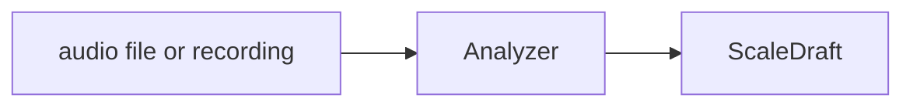
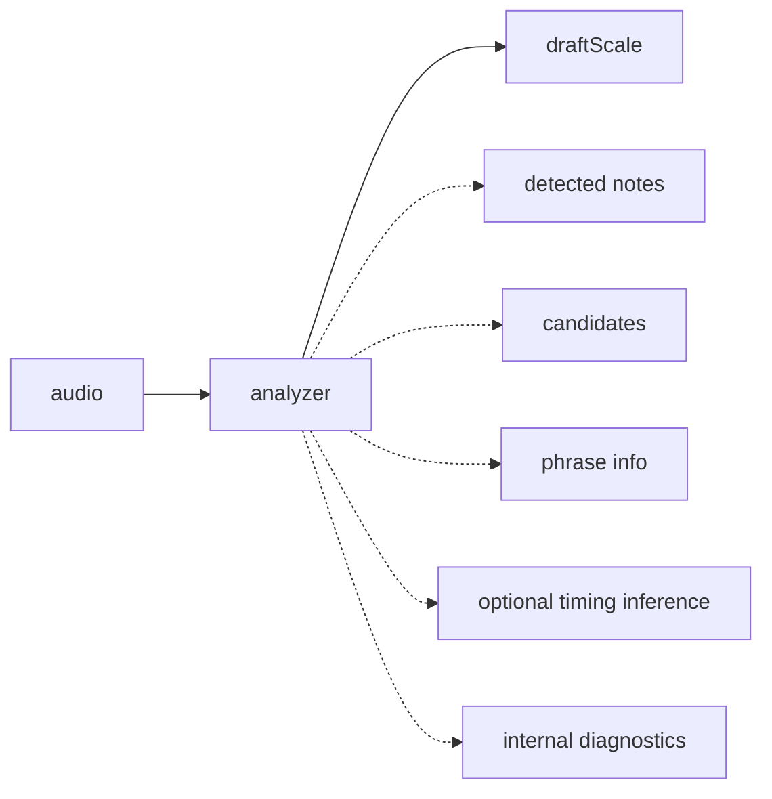
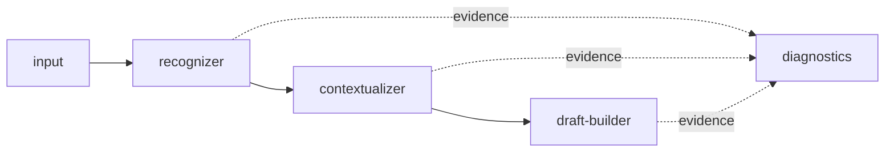
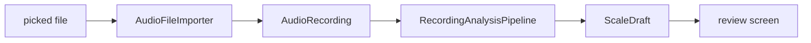
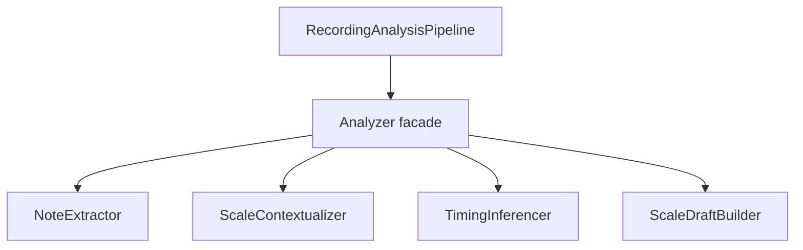
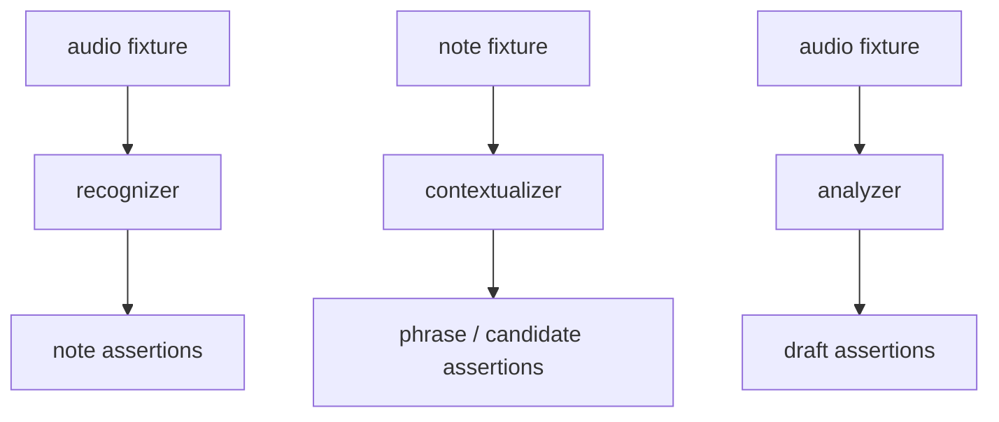

# Analyzer

## Responsibility

The analyzer is the library that turns audio into a playable draft scale.

Low-level recognition details exist inside the analyzer for tuning, debugging, and tests, but they are not the main public contract.

## External Contract



Internally it may also produce diagnostics:



## Internal Shape



### `input`

Owns:

- file import
- later microphone capture
- normalization into `AudioRecording`

Current examples:

- `AudioFileImporter`
- future `AudioRecorder`

### `recognizer`

Owns:

- audio decoding
- pitch extraction
- pitch frame cleanup
- reduction into stable note events

Current examples:

- `AndroidAudioDecoder`
- `AudioFilePitchDetector`
- `DefaultPitchFrameFilter`
- `DefaultNoteEventReducer`

Recommended future abstraction:

```kotlin
interface NoteExtractor {
    suspend fun extract(recording: AudioRecording): NoteExtractionResult
}
```

### `contextualizer`

Owns:

- phrase segmentation
- candidate scale ranking
- interpretation of detected notes as musical structure
- later timing inference between sounds and sets
- optional LLM reasoning over structured evidence

Current examples:

- `DefaultPhraseSegmenter`
- `DefaultScaleCandidateRanker`

Recommended future abstractions:

```kotlin
interface ScaleContextualizer {
    fun contextualize(extraction: NoteExtractionResult): ContextualizedScaleEvidence
}

interface TimingInferencer {
    fun infer(extraction: NoteExtractionResult): InferredTiming
}
```

Important rule:

- if an LLM is used, it belongs after note extraction, not instead of note extraction

### `draft-builder`

Owns:

- conversion from interpreted evidence into `ScaleDraft`

Current example:

- `DefaultScaleDraftBuilder`

## Public API Rule

The app should depend on the analyzer like this:

```kotlin
interface Analyzer {
    suspend fun analyze(recording: AudioRecording): ScaleDraft?
}
```

If the app later wants to show debug evidence, that should come from a separate diagnostics path, not by making pitch frames and note events the primary app-facing API.

## Current Runtime Flow



## What The Analyzer Must Not Know

- Compose screen layout
- navigation routes
- final Room persistence details
- playback UI state

## Good Future Direction

Best cleanup from the current implementation:



## Diagnostics Rule

- `PitchFrame`
- `DetectedNoteEvent`
- `DetectedPhrase`
- `ScaleCandidate`

These are analyzer internals.
They are useful for tests and tuning, but they should not leak into the normal app contract.

## Testing Strategy


