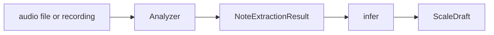
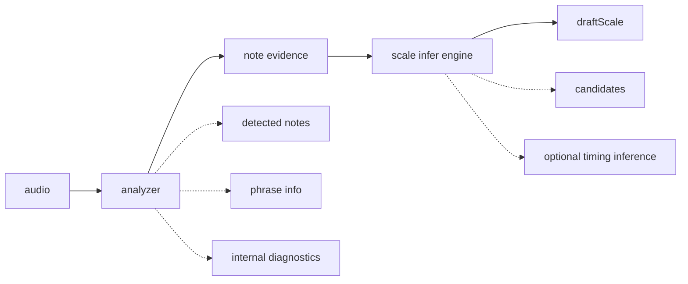
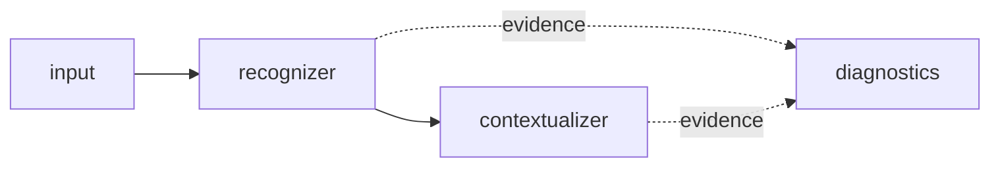
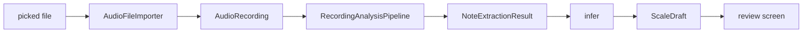
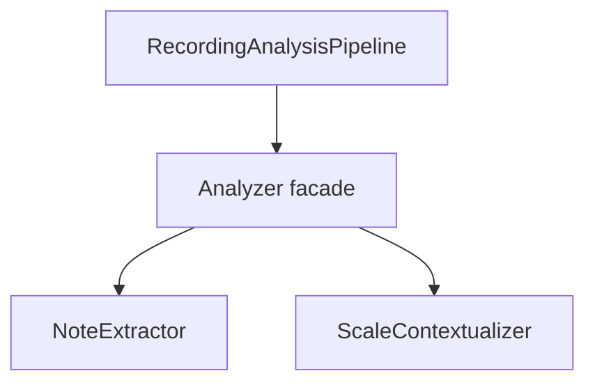
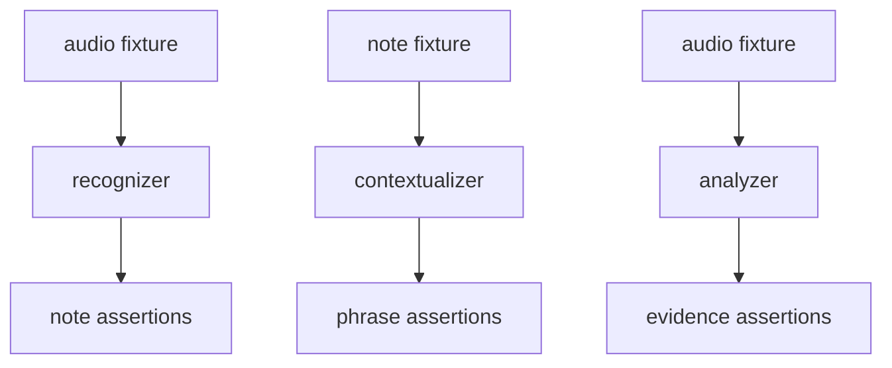

# Analyzer

## Responsibility

The analyzer is the library that turns audio into structured note evidence.

Low-level recognition details exist inside the analyzer for tuning, debugging, and tests, but they are not the main public contract.

## External Contract



Internally it may also produce diagnostics:



## Internal Shape



### `input`

Owns:

- file import
- later microphone capture
- normalization into `AudioRecording`

Current examples:

- `AudioFileImporter`
- future `AudioRecorder`

### `recognizer`

Owns:

- audio decoding
- pitch extraction
- pitch frame cleanup
- reduction into stable note events

Current examples:

- `AndroidAudioDecoder`
- `AudioFilePitchDetector`
- `DefaultPitchFrameFilter`
- `DefaultNoteEventReducer`

Recommended future abstraction:

```kotlin
interface NoteExtractor {
    suspend fun extract(recording: AudioRecording): NoteExtractionResult
}
```

### `contextualizer`

Owns:

- phrase segmentation
- interpretation of detected notes as musical structure
- optional phrase-level cleanup before inference handoff

Current examples:

- `DefaultPhraseSegmenter`

Recommended future abstraction:

```kotlin
interface ScaleContextualizer {
    fun contextualize(extraction: NoteExtractionResult): NoteExtractionResult
}
```

Important rule:

- if an LLM is used, it belongs after note extraction, not instead of note extraction

## Public API Rule

The app should depend on the analyzer like this:

```kotlin
interface Analyzer {
    suspend fun analyze(recording: AudioRecording): NoteExtractionResult
}
```

The app should pass that evidence into `infer` when it wants a draft.

## Current Runtime Flow



## What The Analyzer Must Not Know

- Compose screen layout
- navigation routes
- final Room persistence details
- playback UI state
- editor-assisted reinference policy

## Good Future Direction

Best cleanup from the current implementation:



## Diagnostics Rule

- `PitchFrame`
- `DetectedNoteEvent`
- `DetectedPhrase`

These are analyzer internals.
They are useful for tests and tuning, but they should not leak into editor or player code directly.

## Testing Strategy


