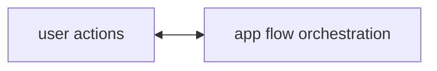
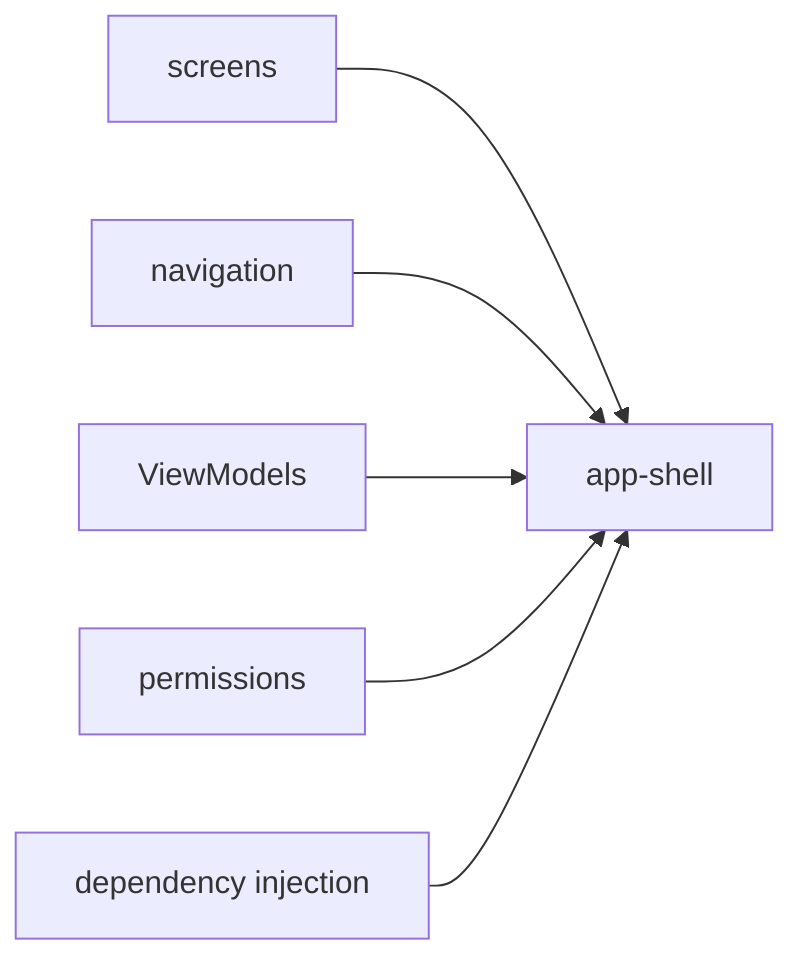

# App Shell

## Responsibility

The app shell wires the internal libraries into a usable Android application.

This is where MVVM lives.

- screens are the Views
- screen `ViewModel`s hold UI state and handle user actions
- the components (`analyzer`, `editor`, `player`, `storage`) are dependencies used by those `ViewModel`s

## External Contract

## Internal Shape

## Current Code Mapping

- `MainActivity`
- `SkalesApplication`
- `ui/navigation/NavGraph.kt`
- screen-specific view models

## Responsibilities

- navigation between library, editor, import, review, and player
- dependency construction and wiring
- file picker integration
- permission and lifecycle handling
- screen-level state ownership through `ViewModel`s

## State Rule

Use this default rule:

- if the state is about what the screen is showing, it belongs in a screen `ViewModel`
- if the state is reusable domain/editor behavior independent of a specific screen, it can live inside a component

Examples:

- selected tab, loading flags, snackbar state: app-shell `ViewModel`
- current editable notes/sets/cursor for a reusable editor workflow: `editor`
- playback engine internals: `player`

## What App Shell Should Avoid

- embedding analyzer logic directly in screens
- embedding playback logic directly in screens
- storing business rules that belong in component libraries
