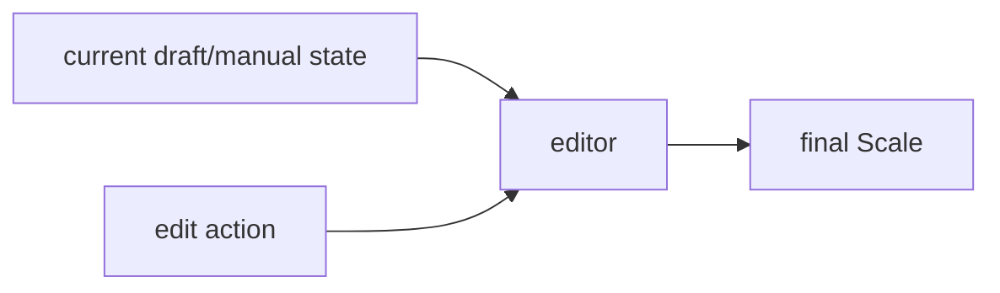
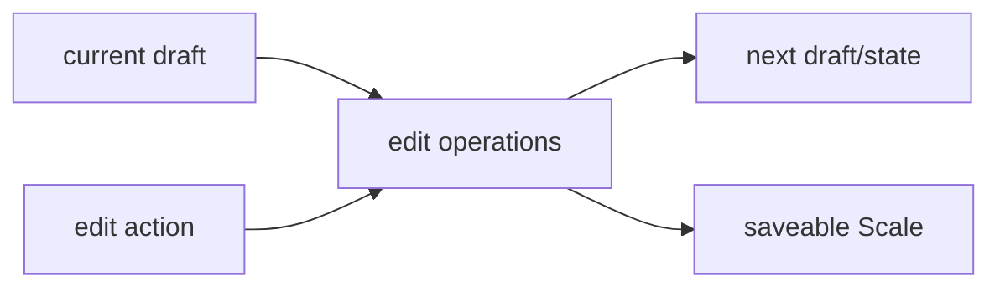
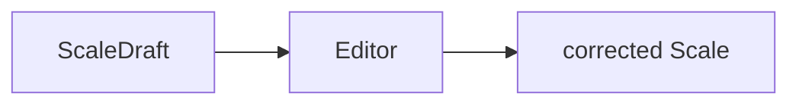

# Editor

## Responsibility

The editor is the **fallback** surface for creating or correcting a `Scale`.

The primary path is recording → auto-recognition. The editor serves two roles:
1. **Correction**: fix mistakes in an auto-recognized scale
2. **Manual creation**: for power users who want full control

Ideally, recording works so well that most users never need the editor. But it must exist as a safety net and for users who prefer manual input.

## External Contract

## Internal Shape

## Current Responsibilities

- pure edit operations over sets/sounds
- draft-to-Scale conversion
- labels/helpers for editor-specific domain behavior

The editor component should not own screen/session state by default.
`selectedSetIndex`, loading flags, playback flags, and navigation state belong in app-layer `ViewModel`s.

## Current Code Mapping

- `editor/ScaleEditorOps.kt`
- `app/viewmodel/ScaleEditorViewModel.kt`
- `app/screens/ScaleEditorScreen.kt`
- `app/components/PianoKeyboard.kt`

Current split:

- `editor/` provides pure editing operations
- `app/viewmodel/ScaleEditorViewModel` owns screen/session state
- `app/` owns UI components and navigation

## Future Role In Audio Flow

The editor should become the correction surface after analysis.

Target handoff:

## What The Editor Must Not Know

- how pitch detection works
- how files are imported
- how candidate ranking is computed

It should accept draft-like data, not own analysis logic.
