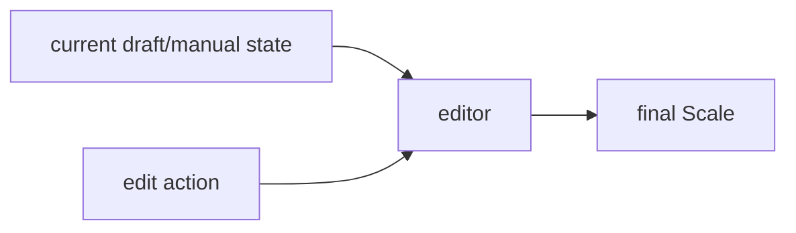
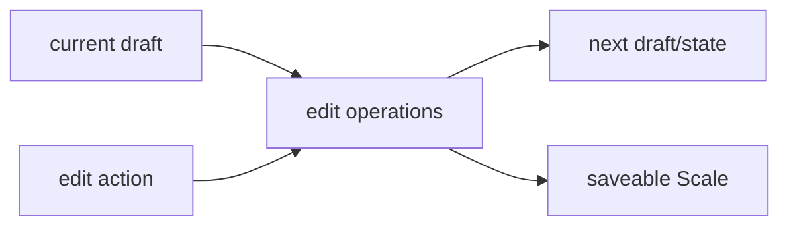
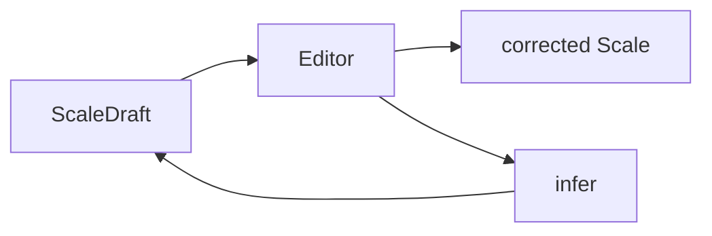

# Editor

## Responsibility

The editor is the surface for creating, correcting, and guiding inference of a `Scale`.

The editor serves three roles:
1. **Correction**: fix mistakes in an auto-recognized scale
2. **Manual creation**: for power users who want full control
3. **Inference seeding**: provide one or more trusted sets, then ask the infer engine to fill the rest

Even if recording works well, the editor must remain the place where the user can lock in what they know and ask the app to infer the rest.

## External Contract

## Internal Shape

## Current Responsibilities

- pure edit operations over sets/sounds
- draft-to-Scale conversion
- labels/helpers for editor-specific domain behavior
- selected-set piano-roll projection and snapping helpers for editor interaction

The editor component should not own screen/session state by default.
`selectedSetIndex`, loading flags, playback flags, and navigation state belong in app-layer `ViewModel`s.

## Current Code Mapping

- `editor/ScaleEditorOps.kt`
- `app/viewmodel/ScaleEditorViewModel.kt`
- `app/screens/ScaleEditorScreen.kt`
- `app/components/PianoKeyboard.kt`

Current split:

- `editor/` provides pure editing operations
- `app/viewmodel/ScaleEditorViewModel` owns screen/session state
- `app/` owns UI components and navigation

## Future Role In Inference Flow

The editor should become both the correction surface after analysis and the manual seed surface for reinference.

Target handoff:

Typical future loop:

1. user writes set 1
2. editor asks the infer engine for a full guess
3. user fixes set 2
4. editor asks again with sets 1 and 2 locked

## Editing Shape

The editor should support multiple sets without turning them into one continuous DAW timeline.

Recommended interaction model:

- show a compact strip of all sets
- make one set active at a time
- edit only the active set in a large piano-roll grid
- keep cross-set movement explicit rather than accidental

That preserves the app's set-based structure while still giving the user a much nicer spacing and pitch editing surface.

## What The Editor Must Not Know

- how pitch detection works
- how files are imported
- how candidate ranking is computed

It should accept draft-like data, not own analysis logic.

It also should not own inference logic. It can request inference, but the guessing belongs in `infer`.
