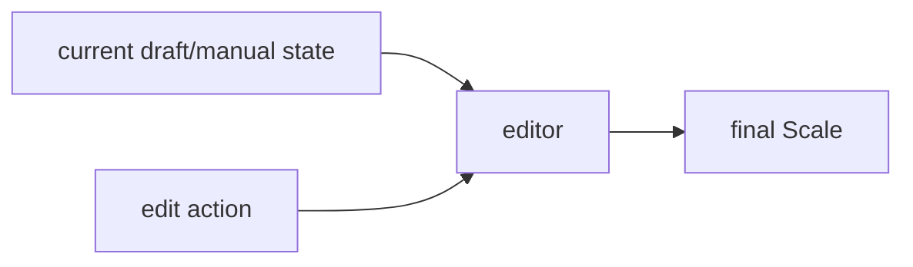
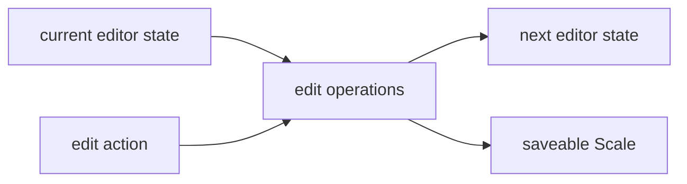
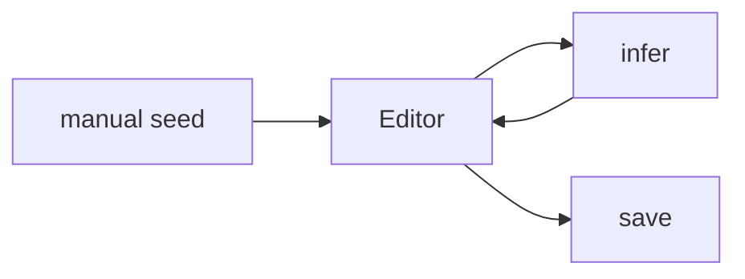

# Editor

## Responsibility

The editor is the surface for creating, correcting, and eventually guiding inference of a `Scale`.

It currently serves three roles:

1. correction of manually entered or inferred scales
2. manual creation
3. future inference seeding

## External Contract

## Current Architectural Shape

## Current Code Mapping

- `editor/ScaleEditorOps.kt`
- `editor/SetGridOps.kt`
- `app/viewmodel/ScaleEditorViewModel.kt`
- `app/screens/ScaleEditorScreen.kt`
- `app/components/PianoKeyboard.kt`
- `app/components/SetPianoRollEditor.kt`

Current split:

- `editor/` owns pure editing operations and grid projection logic
- `app/viewmodel/ScaleEditorViewModel` owns editor screen/session state
- `app/` owns UI components and navigation

## Editor Model

The editor is no longer modeled as one isolated piano roll per active set.

The implemented interaction model is:

- one shared timeline grid for all sets
- one selected set for editing ownership
- other sets rendered as visible context
- floating overlays for playback, grid controls, and sets
- attached keyboard under the roll, sharing pitch scroll with the grid

This is important:

- the editor should feel like one timeline with group boundaries
- sets are still real domain structure
- set boundaries are visual/grouping structure, not separate timing containers

## Timing Rule

For v1, timing is intentionally reduced to one dimension:

- `ScaleSound.breakAfterBeats` is the only editable spacing value
- all sounds are treated as having the same played duration
- there is no velocity or articulation editing
- there is no set-level break anymore

This means:

- spacing between any two adjacent sounds is owned by the earlier sound
- that includes spacing across a set boundary
- moving a set boundary later should increase the `breakAfterBeats` of the last sound of the previous set
- moving a set boundary earlier should decrease that same previous break

The editor now needs to think in timeline-adjacent sound relationships even when the affected sounds belong to different sets.

## Grid Projection Rule

The grid is a projection of the set/sound model, not a second saved model.

Projection requirements:

- render all sounds from all sets on one timeline
- keep set membership for coloring, selection, and overlays
- preserve multi-note sounds as one event with multiple visible pitches
- preserve `ScaleSoundKind` for cue vs note rendering

Current rendering approach:

- note sound: square block
- cue sound: circular block
- multi-note cue: grouped circles that move together

## Rebuild Rule

When the user moves a sound in the shared grid:

- the edit should be interpreted on the shared timeline
- timing deltas should be rebuilt from adjacent sounds across the whole timeline
- rebuilt `breakAfterBeats` values should then be written back into the saved `ScaleSet -> ScaleSound` structure

This shared-timeline rebuild behavior is what allows cross-set spacing edits without reintroducing set-level break fields.

## Selection And Ownership Rule

- selected set controls which sounds are editable
- non-selected sets remain visible but are not directly draggable
- tapping a sound in another set should switch the working set directly from the timeline
- the set boundary is effectively where that set's first sound begins
- separator dragging is the primary explicit control for cross-set spacing
- dragging within a set should keep the separator stable unless the drag is one of the explicit boundary-moving cases

## What The Editor Must Not Become

The current product direction is explicitly not a mini DAW.

Avoid adding by default:

- per-sound duration editing
- velocity editing
- free articulation/envelope tools
- hidden cue-specific timing behaviors
- a second independent timeline model separate from the saved scale model

## Inference Role

The editor should still become the seed-and-correct surface for inference later.

Target loop:

Likely future additions:

- inferred vs confirmed set state
- lock/unlock set controls
- infer missing sets
- better candidate summary/handoff inside the sets overlay

## What The Editor Must Not Know

- how pitch detection works
- how audio files are imported
- how candidate ranking is computed

The editor can request inference, but guessing belongs in `infer`.
