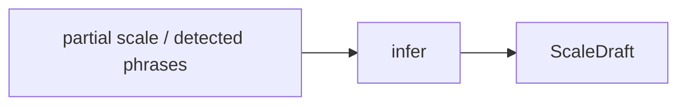
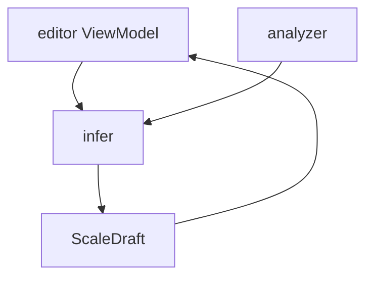

# Infer

## Responsibility

`infer` turns incomplete musical evidence into a `ScaleDraft`.

That evidence can come from either:

- the analyzer after audio recognition
- the editor after the user authors one or more trusted sets

This is the component that supports the iterative workflow:

1. user enters one set
2. engine infers a likely full scale
3. user corrects one or two sets
4. engine infers again with those corrected sets locked in

## External Contract



## Core Rule

Inference is not the same thing as analysis.

- `analyzer` extracts note evidence from audio
- `infer` guesses the full scale shape from partial evidence

That split matters because editor-assisted inference must work even when there is no recording at all.

## Supported Inputs

### Partial editor-authored scale

Example:

- set 1 entered manually
- infer the rest
- user fixes set 2
- infer again

The engine should preserve the user-confirmed sets and only regenerate the unresolved parts.

Editor-driven inference should not assume that the confirmed sets are necessarily the beginning of the full exercise. Confirmed sets may sit inside a larger intended range, with missing sets before them, after them, or on both sides.

### Analyzer evidence

Example:

- analyzer extracts phrases from recording
- `infer` ranks candidate scales
- `infer` builds a draft for review

## Recommended API Shape

```kotlin
interface ScaleInferEngine {
    fun infer(request: ScaleInferenceRequest): ScaleInferenceResult
}
```

Where the request can include:

- current ordered working sets
- which sets are confirmed anchors
- requested suggestion mode
- optional count limit
- optional low and high pitch bounds
- optional name hint
- optional analyzer evidence

## What It Owns

- candidate scale ranking
- filling missing sets from partial scale evidence
- preserving confirmed user-authored sets during reinference
- draft naming suggestions based on the best candidate

## What It Must Not Own

- audio decoding
- pitch detection
- file import
- editor UI state
- persistence

## App-Layer Usage



For editor-driven inference, the important output is usually not a full replacement draft but a reviewable proposal that the editor can merge into the current working sequence.

## Editor Inference Direction

The editor-facing inference flow should be proposal-oriented.

That means:

- confirmed sets are treated as trusted anchors
- inference may generate a small number of probe suggestions first
- inference may later fill a larger requested range
- requested range may extend below, above, or around the confirmed anchors
- editor-facing results should be reviewable proposals, not silent replacements

Two editor actions are expected to be useful:

- `Suggest next` or another small probe action to test whether the engine understood the pattern
- `Fill range` for a larger continuation once the pattern looks right

`Fill range` should not be modeled as append-only. It may need to introduce suggested sets before the currently confirmed block as well as after it.

## Proposal Shape

The exact request and result classes may evolve, but the editor-facing contract should support these concepts:

Request:

- current ordered working sets
- which sets are confirmed
- optional requested scope such as probe count or pitch range
- optional count limit as a safety bound

Result:

- proposed ordered sets for the requested scope
- optional candidate/ranking metadata
- optional name suggestion

For an LLM-backed inference engine, returning a full proposed ordered sequence for the requested scope may be simpler and more robust than returning only append operations or surgical insert instructions.

## Editor Merge Rules

The editor merge step should follow these rules:

- confirmed sets are never silently replaced
- suggested sets may be regenerated
- accepting a suggestion promotes it to confirmed
- directly editing a suggested set promotes it to confirmed
- rejecting a suggestion removes it from the working sequence
- inference may insert suggested sets before existing confirmed sets if the requested range requires it

This keeps the working model simple:

- one ordered working sequence in the editor
- per-set review state on top of that sequence
- one saved `Scale` domain model once the user is satisfied

## Current Direction

Initial implementation can stay heuristic and lightweight.

The important architectural move is separating:

- extraction of evidence
- inference from evidence

That keeps future improvements localized. Better ranking, richer templates, or LLM-assisted completion can happen inside this component without dragging recording concerns into it.
