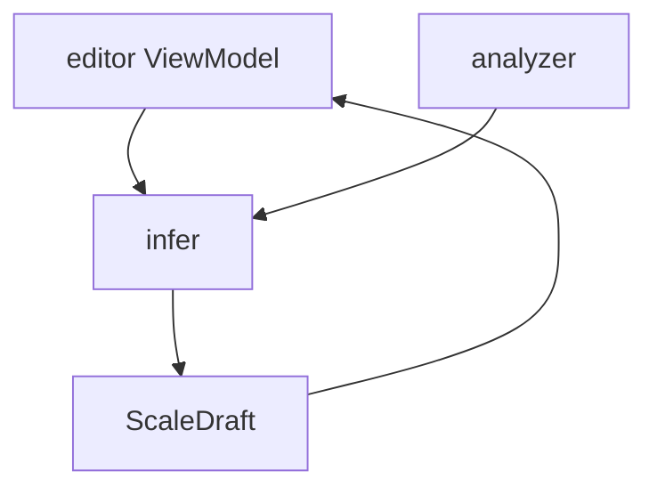

# Infer

## Responsibility

`infer` turns incomplete musical evidence into a `ScaleDraft`.

That evidence can come from either:

- the analyzer after audio recognition
- the editor after the user authors one or more trusted sets

This is the component that supports the iterative workflow:

1. user enters one set
2. engine infers a likely full scale
3. user corrects one or two sets
4. engine infers again with those corrected sets locked in

## External Contract


## Core Rule

Inference is not the same thing as analysis.

- `analyzer` extracts note evidence from audio
- `infer` guesses the full scale shape from partial evidence

That split matters because editor-assisted inference must work even when there is no recording at all.

## Supported Inputs

### Partial editor-authored scale

Example:

- set 1 entered manually
- infer the rest
- user fixes set 2
- infer again

The engine should preserve the user-confirmed sets and only regenerate the unresolved parts.

### Analyzer evidence

Example:

- analyzer extracts phrases from recording
- `infer` ranks candidate scales
- `infer` builds a draft for review

## Recommended API Shape

```kotlin
interface ScaleInferEngine {
    fun infer(request: ScaleInferenceRequest): ScaleInferenceResult
}
```

Where the request can include:

- current sets
- locked set indices
- desired set count
- optional name hint
- optional analyzer evidence

## What It Owns

- candidate scale ranking
- filling missing sets from partial scale evidence
- preserving locked user-confirmed sets during reinference
- draft naming suggestions based on the best candidate

## What It Must Not Own

- audio decoding
- pitch detection
- file import
- editor UI state
- persistence

## App-Layer Usage



## Current Direction

Initial implementation can stay heuristic and lightweight.

The important architectural move is separating:

- extraction of evidence
- inference from evidence

That keeps future improvements localized. Better ranking, richer templates, or LLM-assisted completion can happen inside this component without dragging recording concerns into it.
