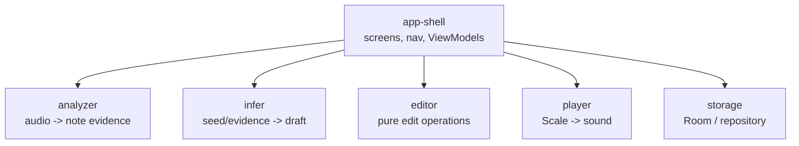
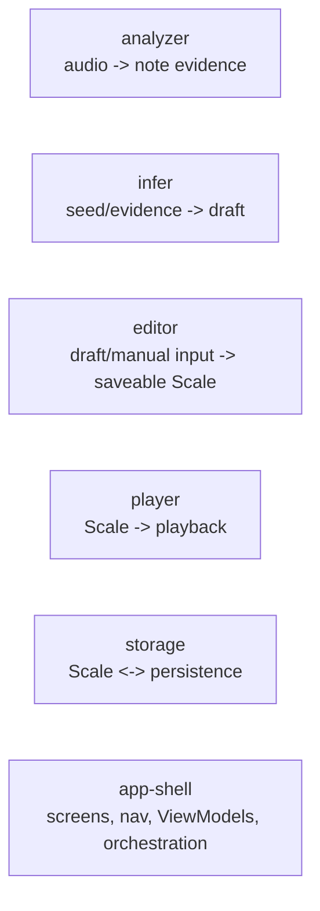
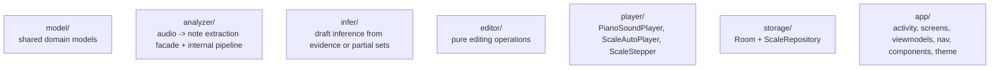
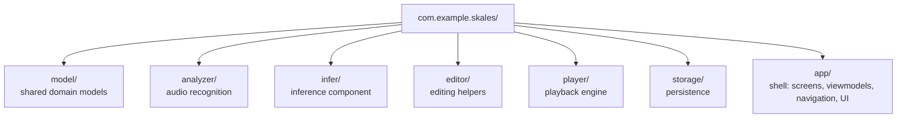
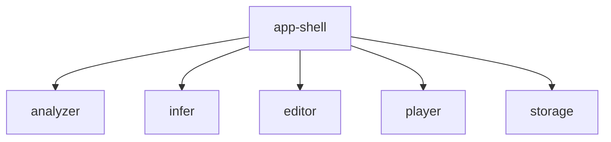

# Architecture Overview

## Mental Model

Think of Skales as an Android shell around a few internal libraries.

This is not in conflict with MVVM.

- MVVM is the screen-layer pattern
- components are the domain/service boundaries behind the screens

In practice:

- `View` = Compose screens
- `ViewModel` = screen state + user-intent handling
- `Model` = app models plus component APIs (`Scale`, `ScaleDraft`, `Analyzer`, `ScaleInferEngine`, `ScaleRepository`, etc.)

So the app can be both:

- MVVM at the UI layer
- component/library-oriented at the domain layer

Current preference:

- components should default to being testable libraries with narrow APIs
- screen `ViewModel`s should own screen/session state
- only keep state inside a component when it is true engine state that cannot reasonably live at the screen layer

Primary components:

- `analyzer`
- `infer`
- `player`
- `editor`
- `storage`
- `app-shell`

## Component Diagram

The key point is that components do not all persist directly.

- `storage` is a separate persistence component
- `app-shell` decides when to save or load through `storage`
- `analyzer`, `infer`, `editor`, and `player` should not write persistent app state themselves

## Ownership Summary

More concretely:

- `analyzer` produces note and phrase evidence
- `infer` turns note evidence or partial editor-authored sets into a draft
- `editor` transforms draft/manual input into a saveable `Scale`
- `player` consumes a `Scale` for playback
- `storage` saves and loads final approved `Scale`s
- `app-shell` coordinates those handoffs

State should not all live in one place.

- screen/UI state belongs in screen `ViewModel`s
- components should prefer pure operations and input/output contracts
- analyzer/storage should be effectively stateless from the app's point of view
- player may have short-lived engine internals, but playback session state should usually live in a `ViewModel`

## Current Code Mapping

The components are packages within `com.example.skales`:

## Dependency Direction

The intended dependency flow is:

And not the other way around.

That does not mean all components call `storage`.
It means `app-shell` depends on all of them and coordinates between them.

Component rules:

- `player` should not know about raw analysis models
- `storage` should persist final approved scales, not arbitrary raw analysis state
- `editor` should not own pitch detection logic
- `analyzer` should not depend on Compose UI code
- `infer` should not own recording/file import concerns

## Document Map

- `analyzer.md`: audio-to-evidence library
- `infer.md`: partial-scale and evidence-to-draft library
- `player.md`: playback library
- `editor.md`: manual editing library
- `storage.md`: persistence library
- `app-shell.md`: Android orchestration layer
