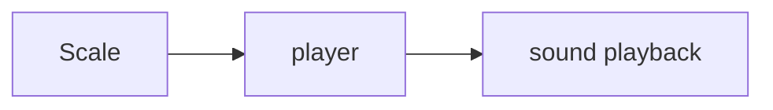
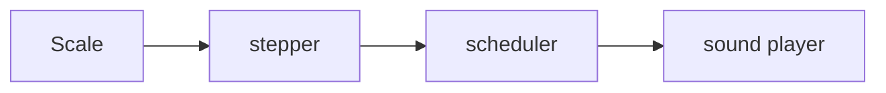
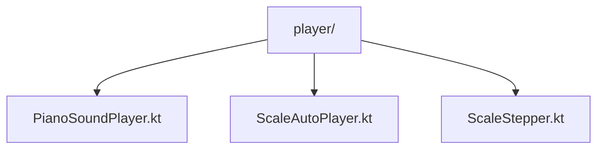
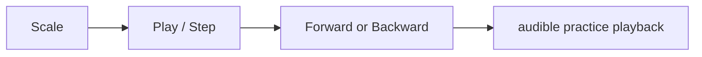

# Player

## Responsibility

The player is the library that turns a final `Scale` into audible playback.

The player should prefer operation-style APIs over owning screen session state.

## External Contract

## Internal Shape

Screen/session state such as current cursor, direction, and play/pause status should usually live in a `ViewModel`.

## Main Parts

### `ScaleStepper`

Owns:

- one playback step at a time
- next-cursor calculation
- per-step wait calculation

### `ScaleAutoPlayer`

Owns:

- repeated stepping over time
- BPM-based scheduling
- stop/cancel behavior

This may have short-lived internal runtime state, but it should not become the owner of screen playback state.

### `PianoSoundPlayer`

Owns:

- actual piano sample playback
- note/chord playback output

## Input Model

The player consumes the saved playback model:

- `Scale`
- `ScaleSet`
- `ScaleSound`
- `PlaybackTiming`

## What The Player Must Not Know

- whether the scale was manually authored or analyzed from audio
- raw note-detection evidence
- Room entities
- screen-level navigation state

## Current Code Mapping

## Current Behavior

## Future Extension Points

- playback preview in draft review
- richer break timing support
- transpose at playback time
- metronome or count-in cue
