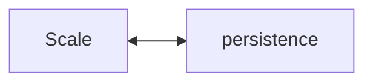
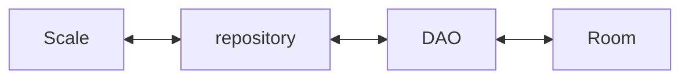
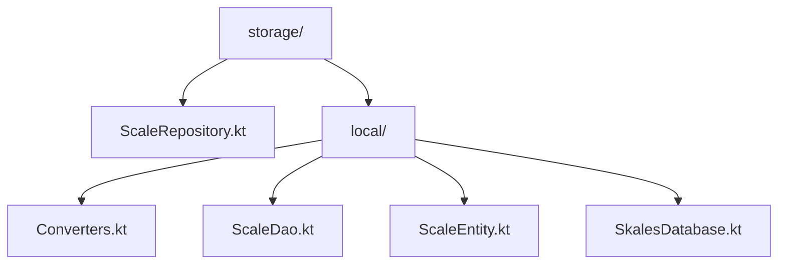

# Storage

## Responsibility

Storage persists approved final scales and retrieves them for the rest of the app.

## External Contract

## Internal Shape

## Current Code Mapping

## Current Rule

Storage is for final approved playback objects.

Preferred rule:

- store `Scale`
- do not store arbitrary raw analyzer internals unless there is a clear product need

## What Storage Must Not Know

- Compose layout state
- pitch recognition logic
- playback scheduling details
