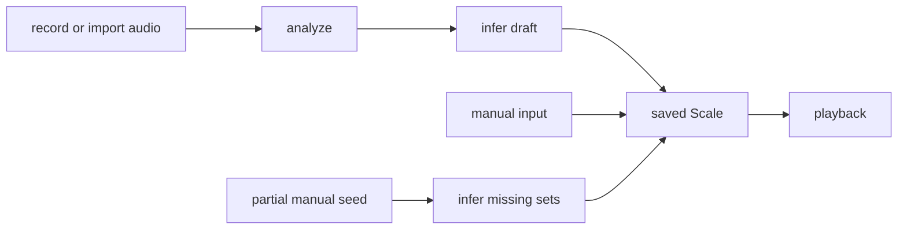
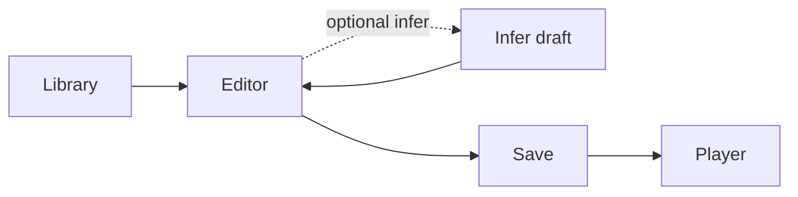
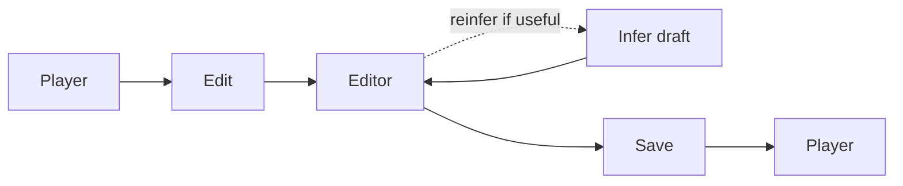

# Skales Overview

## Product Summary

Skales is an Android app for creating, inferring, saving, and replaying custom singing-practice scales.

The product vision is recording-first scale creation: the user can sing or play a scale, the app recognizes it, the result is reviewed and corrected if needed, and the saved scale is used for repeated practice playback.

The initial product focus is narrower: make scale creation easy in the editor and use `infer` to fill in missing sets, so the core creation workflow is solid before recording analysis is added.

## Product Vision

The intended end-state of Skales is:

```text
record or import audio -> analyze -> infer draft -> correct -> save -> play
```

That is the main product story.

The reason this matters:

- recording is the most magical and differentiated entry point
- users often already know a scale by ear or from practice, but do not want to manually enter every set
- playback is the payoff, but easy creation is what makes the library worth using

## Core Promise



The product is **recording-led in vision, playback-focused in value, and correction-friendly in execution**.

## Current Build Focus

Current focus:

- editor-first scale authoring
- partial-set inference and reinference
- active-set piano-roll editing with visible note spacing
- clear correction flow before save
- smooth playback of saved scales

Why this comes first:

- recording analysis is harder than editor and inference work
- a strong analyzer still depends on a good correction target
- editor + infer already solves a real user problem on its own

Near-term ideal flow:

```text
enter notes in the editor -> adjust spacing in the piano roll -> infer the rest -> correct -> save -> play
```

## Deferred For Now

These belong to later phases rather than the initial delivery scope:

- recording analysis as the primary user-facing creation path
- microphone capture workflow
- polished import-to-review correction flow

## Core User Jobs

The app should help the user:

- create a scale manually
- place and drag notes on a piano-roll grid with clear spacing
- seed one or more sets and infer the rest
- inspect and correct a draft before saving
- replay scales repeatedly for practice
- adjust playback pace and direction
- later, derive a scale from audio

## Main Flows

### Flow A: Recording Import (Vision)


This is the intended flagship flow for the product.

### Flow B: Seed And Infer (Current Priority)


This is the current priority path. The user seeds one or more known sets, the app infers the rest, and the user tightens the result until it is ready to save.

In practice, that tightening happens in a selected-set piano roll with configurable snap sizes.

### Flow C: Manual Creation (Direct)



For users who want full control or want to bypass inference and author everything manually.

### Flow D: Practice Existing Scale


### Flow E: Correction



When a saved scale needs adjustment.

## Stable Product Decisions

These should remain stable unless there is a strong reason to change them:

- `Scale` is the final saved playback object
- `ScaleSet` is one repeatable exercise unit. A `Scale` consists of many `ScaleSet`s. 
- users should review inferred results before saving when confidence is uncertain
- audio analysis should produce evidence, not just a black-box answer
- scale completion should be a separate inference step, not hidden inside audio analysis
- the component name should stay `infer` everywhere in the docs and architecture
- manual correction should reuse the editor rather than inventing a second editing model
- the MVP scope can be narrower than the full product vision

## Current State

Implemented now:

- scale library screen
- manual editor with selected-set piano roll
- scale player
- local persistence with Room
- deterministic analysis pipeline for note evidence extraction
- deterministic `infer` support for draft generation from evidence or partial sets

MVP gaps:

- locked-set reinference flow in the editor
- clearer inferred-vs-confirmed set state inside the editor
- richer timing inference between sounds and sets
- playback preview inside the review flow
- polished final UI/UX

Later phases:

- microphone recording flow
- opening analyzed drafts directly in the editor for correction

## In Scope

- monophonic scale-like exercises first
- editor-first scale authoring
- partial-set inference and reinference
- repeatable practice playback
- the recording-led product direction as a design constraint

## Out Of Scope For Now

- recording analysis and import-driven creation in the MVP
- microphone capture workflow
- cloud sync
- collaboration
- advanced sheet-music style editing
- opaque AI-only inference with no structured evidence

## Design Rule

When a new feature is proposed, keep these three questions explicit:

1. what user job does it support?
2. which architecture component owns it?
3. what screen should expose it?
