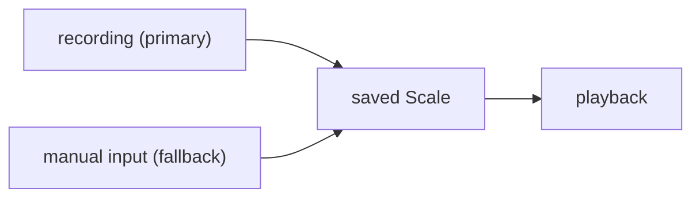
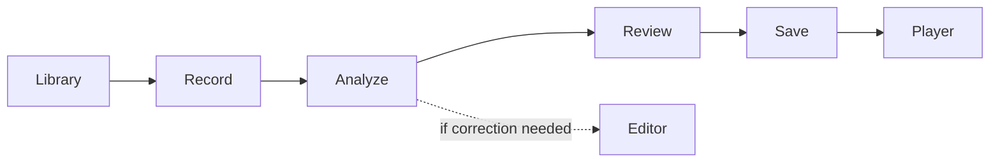
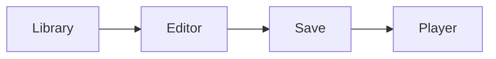
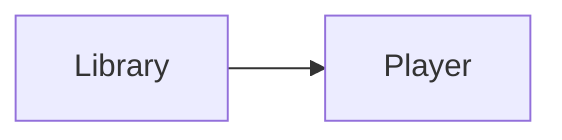
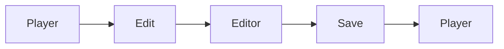

# Skales Overview

## Product Summary

Skales is an Android app for creating, saving, and replaying custom singing-practice scales.

The primary creation path is **recording**: the user taps a mic button, plays or sings a scale, and the app recognizes it.

The goal is for recording to work so well that users rarely need manual editing. However, manual authoring exists as a fallback for correction or creating scales from scratch if desired.

## Core Promise

The product is **recording-first, playback-focused**.
The ideal flow: record → auto-recognize → play.
The editor exists for correction and power users who want full manual control.

## Core User Jobs

The app should help the user:

- create a scale manually
- derive a scale from audio
- inspect and correct a draft before saving
- replay scales repeatedly for practice
- adjust playback pace and direction

## Main Flows

### Flow A: Recording (Primary)

This is the ideal path. The user records, the app recognizes, and they practice.

### Flow B: Manual Creation (Fallback)

For power users who want full control or when recording isn't practical.

### Flow C: Practice Existing Scale

### Flow D: Correction

When a saved scale needs adjustment.

## Stable Product Decisions

These should remain stable unless there is a strong reason to change them:

- `Scale` is the final saved playback object
- `ScaleSet` is one repeatable exercise unit
- users should review inferred results before saving when confidence is uncertain
- audio analysis should produce evidence, not just a black-box answer
- manual correction should reuse the editor rather than inventing a second editing model

## Current State

Implemented now:

- scale library screen
- manual editor
- scale player
- local persistence with Room
- audio-file import and draft review flow
- deterministic analysis pipeline for note and scale inference

Not finished yet:

- microphone recording flow
- opening analyzed drafts directly in the editor for correction
- richer timing inference between sounds and sets
- playback preview inside the review flow
- polished final UI/UX

## In Scope

- monophonic scale-like exercises first
- imported audio analysis
- later microphone recording
- deterministic recognition plus optional higher-level interpretation
- repeatable practice playback

## Out Of Scope For Now

- cloud sync
- collaboration
- advanced sheet-music style editing
- opaque AI-only inference with no structured evidence

## Design Rule

When a new feature is proposed, keep these three questions explicit:

1. what user job does it support?
2. which architecture component owns it?
3. what screen should expose it?
